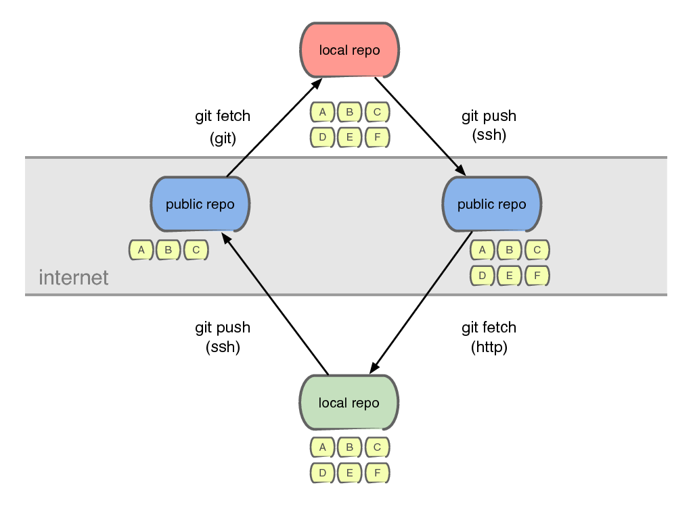

!SLIDE subsection

# Git Collaboration #

!SLIDE
# Begriffe #

!SLIDE
# Clone #

Kopie eines Repositories mit allen Informationen

!SLIDE
# Remote #

Anderes Repository, welches mit dem aktuellen Repository verknüpft ist

!SLIDE
# Fetch #
Inhalt eines Remotes in das lokale Repository holen

!SLIDE
# Pull #
Inhalt eines Remotes holen und integrieren (Fetch + Merge)

!SLIDE
# Push #
Lokale Änderungen an ein Remote senden

!SLIDE smbullets
# Internet <-> Git

* minimale Kommunikation mit Remotes
* Das meiste geht offline (ausser: fetch, pull, push)
* Ein Git-Repository kann mit beliebig vielen Remotes verknüpft werden
* Auf Remotes kann man entweder lesen, schreiben oder beides

!SLIDE
# Beispiel: Ablauf der Zusammenarbeit mit Git #

!SLIDE center

!SLIDE center

!SLIDE center

!SLIDE center

!SLIDE center

!SLIDE center

!SLIDE center

!SLIDE
# Befehle #

!SLIDE commandline small
# git-remote [command] [name] #

Remote hinzufügen
    $ git remote add origin git@github.com:senny/git-showoff.git

    $ git remote add origin https://senny@github.com/senny/git-showoff.git

    $ git remote add origin git://github.com/senny/git-showoff.git

    $ git remote add origin file:///Users/senny/Projects/git-showoff

    $ git remote add origin /Users/senny/Projects/git-showoff

Remote löschen
    $ git remote rm origin

!SLIDE commandline
# git-fetch [remote] [refspec] #

Alle Änderungen von "origin" holen
    $ git fetch origin

Änderungen auf dem "master" branch von "origin" holen
    $ git fetch origin master

!SLIDE commandline
# git-push [remote] [refspec] #
Änderungen auf dem "master" Branch veröffentlichen
    $ git push origin master

"new_master" unter dem Namen "master" veröffentlichen
    $ git push origin new_master:master

Veröffentlichter Branch löschen
    $ git push origin :master

Aufräumen von remote gelöschten branches
    $ git remote prune origin

!SLIDE commandline
# git pull [remote] [refspec]

"master" aktualisieren und integrieren
    $ git pull origin master

!SLIDE center

