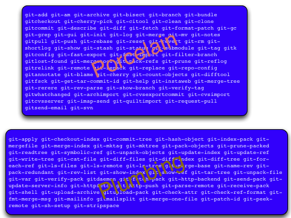

!SLIDE subsection

# Git Konzepte #

!SLIDE
## Architecture ##

!SLIDE center 

!SLIDE center 

!SLIDE code
log HEAD^^ ist eine Kombination aus rev-parse + log

!SLIDE 
# Git Tips #

!SLIDE commandline small
# Aliases #

    $ git config alias.co checkout
    $ git config alias.mnf "merge --no-ff"
    $ git config alias.l "log --decorate --oneline"
    $ git config alias.lg "log --graph"
    $ git config alias.lga "log --decorate --oneline --graph --all"

!SLIDE bullets
## Storage ##

* Git storage internals
* Git hashing

!SLIDE center
## Delta Storage (z.B. Subversion) ##

## Snapshot Storage (z.B. GIT) ##

!SLIDE 
## Git uses DAG storage ##

!SLIDE 
## Directed Acyclic Graph ##

!SLIDE
## vollständige Kopie des Graphen bei jedem Checkin ##

!SLIDE bullets
## Optimierung ##
* Verwendung von hardlinks
* zlib zum komprimieren

!SLIDE
## Server orientierte VCSs verwenden sequentielle Versions Nummern ##

!SLIDE
## Git verwendet den SHA-1 hash 

!SLIDE bullets
# Ein Commit in GIT umfasst #
* Autor (Name, E-Mail, Datum/Zeit)
* Committer (Name, E-Mail, Datum/Zeit)
* 0-n Parents
* Beschreibungstext
* Snapshot

!SLIDE bullets
# Alle Commits in GIT #
* werden durch den SHA1-Hash ihres Inhalts eindeutig identifiziert
* sind unveränderlich
* werden wiederverwendet

!SLIDE center

!SLIDE 
## teures und billiges tagging ##

!SLIDE commandline
## billig
    $git tag name <treeish>

## teuer
    $git tag -a 

!SLIDE bullets
# Branches in GIT #
* Branch = Referenz auf ein Commit
* Ausgecheckter Branch "bewegt" sich beim Committen
* Jedes Repository hat seine Branches

!SLIDE commandline 
# Branching #
## Erzeugen   
    $git branch branchname
## Anzeigen
    $git branch -a
    $git branch -r
    $git branch --no-merged

## Löschen 
    $git branch -d branchname

!SLIDE commandline
# Merging
    $git merge branchname

!SLIDE bullets
# Merge Strategien
* recurisve
* octopus

!SLIDE
# Merge Konflikte lösen

!SLIDE
# Merge Tooling
## Wie konfiguriert man ein graphisches GUI

!SLIDE bullets
# Das .git Verzeichnis #
* liegt im Root der Working Copy
* enthält alle Commits
* enthält Branches
* enthält (lokale) Konfiguration etc.

!SLIDE
# Treeish #

!SLIDE
# SHA-1 Hash #

    b645be7a5d01cb5e143fcd2c0581a4dc69c595b9

!SLIDE
# Partial SHA-1 #

    b645be7a5d01cb5e143fcd2c0581a4dc69c595b9
    b645be7a5d01cb5e1
    b645be7a5d
    b645be7

!SLIDE
# Branch, Remote or Tag Name #

    origin/master
    refs/remotes/origin/master
    master
    refs/heads/master
    v1.0
    refs/tags/v1.0

!SLIDE
# Carrot Parent #

    master^
    master^2
    master^3

!SLIDE
# Tilde Spec #

    master~2
    master~3
    master~7

!SLIDE
# Date Spec (Lokal) #

    master@{yesterday}
    master@{1 month ago}

!SLIDE
# Ordinal Spec (Lokal) #

    master@{1}
    master@{5}

!SLIDE
# Blob Spec #

    <treeish>:<path>

    master:/path/to/file
    my_feature:/app/models/person.rb
    release/1.0:/spec/models/person_spec.rb

!SLIDE
# Range #

    <treeish>..<treeish>

    7b593b5..51bea1
    master..my_feature
